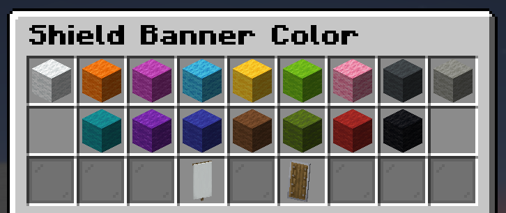
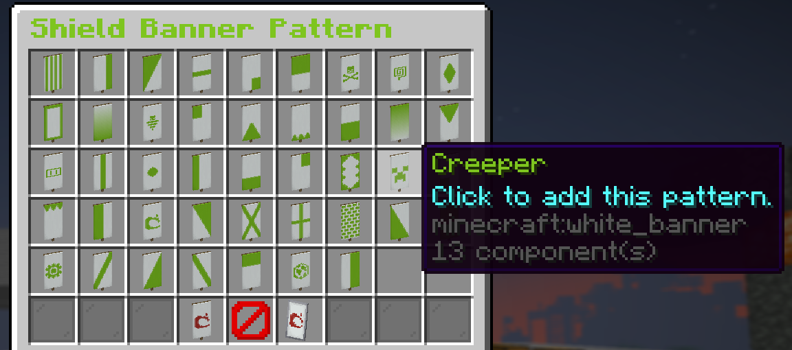
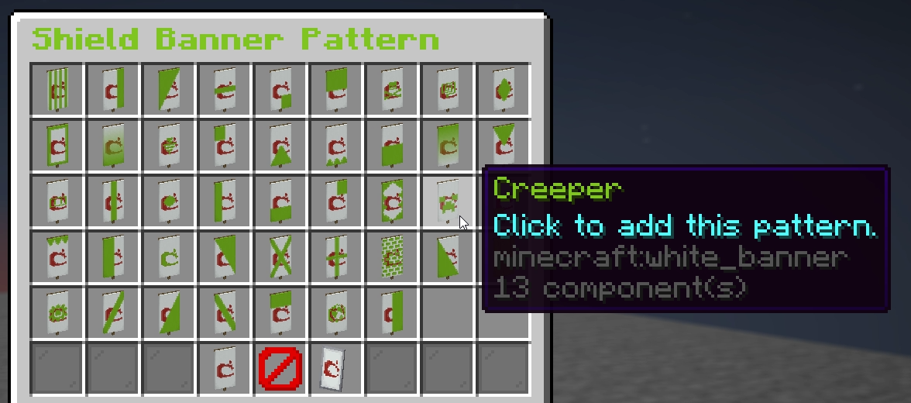

# shield-patterns

Let your players create fully custom shield banner patterns through a simple in-game GUI.


---

## Showcase

<p>
  
  
</p>
<p>
  
</p>

---

## Features

- In-game GUI to pick a color and stack up to 'n' patterns on your shield
- Patterns are saved to a SQLite database and persist across restarts
- Applied automatically when a player clicks a shield in their inventory
- Supports overriding shields that already have patterns
- Fully configurable messages via `messages.yml` using [MiniMessage](https://docs.papermc.io/adventure/minimessage/format)
- Admin commands to reset any player's banner and reload configs

---

## Commands

| command | description                             | permission |
|---|-----------------------------------------|---|
| `/shieldbanner` | Open the banner creator GUI             | `shieldpatterns.shieldbannercreate` |
| `/shieldreset <player>` | Reset a player's shield banner          | `shieldpatterns.admin` |
| `/shieldreload` | Reloads `config.yml` and `messages.yml` | `shieldpatterns.admin` |

> Alias for `/shieldbanner`: `/banner`<br>
> You can add more aliases via your server's `commands.yml`. See the [Bukkit documentation](https://bukkit.fandom.com/wiki/Commands.yml) for details.

---

## Permissions

| permission | description                            | default |
|---|----------------------------------------|---|
| `shieldpatterns.shieldbannercreate` | Use `/shieldbanner`                    | op |
| `shieldpatterns.shieldbanneruse` | Apply banner to shields on click       | op |
| `shieldpatterns.admin` | Use `/shieldreset` and `/shieldreload` | op |

---

## Configuration

**`config.yml`**

```yaml
# The prefix to use for messages.
# Set to "" to disable.
prefix: "<dark_gray>[<aqua>shield-banners</aqua>]<reset> "
# Maximum number of patterns to allow the players to stack.
# Setting this too high (for example: 1024) will be negative for performance.
max-patterns: 32
# If enabled, existing patterns from shields will be overridden.
should-override: true
# If enabled, the vanilla pattern name will be hidden.
hide-vanilla-pattern-name: true
# If true, the pattern preview in the GUI will show the full result on the shield instead of the plain pattern on a blank banner.
gui-show-result: false
```

All messages in `messages.yml` support full [MiniMessage](https://docs.papermc.io/adventure/minimessage/format) formatting, including hex colors, gradients, sprites and decorations.

---

## Build

You can build the plugin yourself with Maven:

```bash
mvn clean package
```

The output jar will be at `target/shield-patterns-<version>.jar`.
